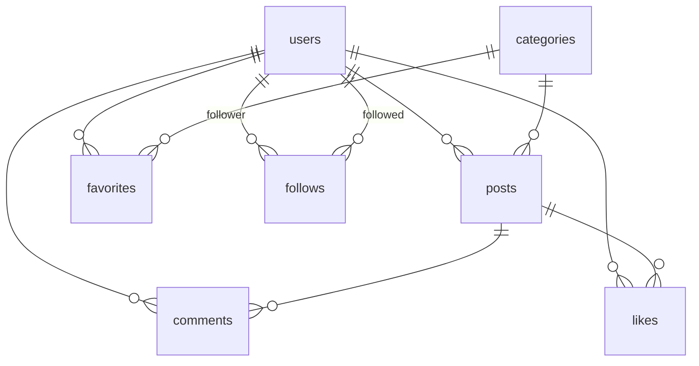

# Conome（コノミー）

## 1. アプリ概要

「好き」を共有するSNS  

※開発中のため、現在はテストユーザーでのみご利用可能です  
<https://conome-4e6d09dc0d5e.herokuapp.com>

### 主な機能

準備中...

### 開発背景

準備中...

### 工夫したこと

準備中...

### 苦労したこと

準備中...

### 今後やりたいこと

準備中...

<br>

## 2. 使用技術

### 言語等

| 名前       | バージョン or 説明        |
| ---------- | ------------------------- |
| PHP        | 8.3                       |
| JavaScript | *                         |
| Blade      | Laravelビューテンプレート |
| CSS        | *                         |

### フレームワーク

| 名前         | バージョン | 説明                     |
| ------------ | ---------- | ------------------------ |
| Laravel      | 11.9       | PHPフレームワーク        |
| Alpine.js    | 3.4.2      | JavaScriptフレームワーク |
| Tailwind CSS | 3.1.0      | CSSフレームワーク        |

### ライブラリ・パッケージ

| 名前           | バージョン | 説明             |
| -------------- | ---------- | ---------------- |
| Laravel Breeze | 5.4.8      | ユーザー認証機能 |

### 開発環境・その他

| 名前               | バージョン | 説明                             |
| ------------------ | ---------- | -------------------------------- |
| PostgreSQL         | 16         | RDBMS                            |
| Nginx              | 1.27.2     | Webサーバー                      |
| Heroku             | *          | クラウド                         |
| Vite               | 5.4.8      | FE環境（ビルド・開発サーバー等） |
| Node.js            |            |                                  |
| npm                |            |                                  |
| Docker             | 4.34.3     |                                  |
| Visual Studio Code | 1.94.2     | ソースコードエディタ             |
| Git                | 2.45.2     | バージョン管理                   |
| GitHub             | *          | ソースコード管理                 |
| pgAdmin4           | 8.12       | PostgreSQL GUI管理ツール         |
| Mermaid            | 11.2.1     | ER図作成                         |

<br>

## 3. 要件定義

**実装優先度**

- p1：必ず実装
- p2：実装予定
- p3：余裕があれば実装

### 機能要件

<details>
<summary>クリックで詳細が開きます</summary>
<br>

**ユーザー管理**

- [x] p1: 新規登録・ログイン・ログアウト・アカウント削除
- [ ] p3: 新規登録時のメール認証
- [ ] p1: パスワードリセット
- [ ] p3: メールアドレス変更
- [x] p1: ログイン維持
- [ ] p3: ソーシャルログイン
- [x] p1: プロフィール編集

**投稿**

- [x] p1: タイトルと内容
- [ ] p1: 画像
- [ ] p3: 動画
- [ ] p3: ハッシュタグ（ラベル）
- [x] p1: カテゴリを選択

**投稿一覧表示**

- [x] p1: 全ユーザーの投稿表示
- [x] p1: プロフィールから自分の投稿表示
- [x] p2: フォローユーザーの投稿表示
- [x] p2: お気に入りカテゴリーのソート

**インタラクション**

- [x] p2: いいね（投稿）
- [ ] p3: いいね（コメント）
- [x] p2: お気に入り（カテゴリー）
- [x] p2: ユーザーフォロー
- [ ] p3: ユーザーブロック
- [ ] p3: ユーザー非表示
- [ ] p3: 拡散
- [x] p2: 投稿へのコメント
- [ ] p3: コメントへのコメント（ツリー）
- [ ] p3: ダイレクトメッセージ
- [ ] p3: 外部サイトでの共有

**検索機能**

- [ ] p1: ユーザー検索
- [ ] p3: ハッシュタグ検索
- [ ] p1: キーワード検索

**通知機能**

- [ ] p3: フォロー・いいね・拡散・コメント・ダイレクトメッセージ時の通知
- [ ] p3: ブラウザプッシュ通知

</details>

### 非機能要件

<details>
<summary>クリックで詳細が開きます</summary>
<br>

**セキュリティ**

- データ暗号化
- スパム・不適切コンテンツ対策
- 個人情報を収集しない

**ユーザビリティ**

- 直感的で使いやすい UI/UX
- レスポンシブ対応
- 多言語対応

**パフォーマンス**

- 高速なレスポンス時間
- 大量のデータを処理できるスケーラビリティ

**可用性**

- 24 時間 365 日の安定稼働
- データのバックアップ

</details>

<br>

## 4. データベース設計

**DB: PostgreSQL**

### テーブル詳細

<details>
<summary>ユーザー (users)</summary>

| #   | 論理名             | 物理名            | データ型     | Key | Not NULL | 初期値 | 備考           |
| --- | ------------------ | ----------------- | ------------ | --- | -------- | ------ | -------------- |
| 1   | ユーザーID         | id                | bigint       | PK  | O        |        | AUTO_INCREMENT |
| 2   | アカウントID       | uid               | text         | UK  | O        |        |                |
| 3   | 表示名             | name              | text         |     | O        |        |                |
| 4   | 自己紹介           | content           | text         |     |          | NULL   |                |
| 5   | 生年月日           | birthday          | date         |     |          | NULL   |                |
| 6   | メールアドレス     | email             | varchar(255) | UK  | O        |        |                |
| 7   | メールアドレス認証 | email_verified_at | timestamp    |     |          | NULL   |                |
| 8   | パスワード         | password          | varchar(255) |     | O        |        |                |
| 9   | パスワードトークン | remember_token    | varchar(100) |     |          | NULL   |                |
| 10  | 作成日時           | created_at        | timestampsTz |     | O        |        |                |
| 11  | 更新日時           | updated_at        | timestampsTz |     | O        |        |                |

</details>

<details>
<summary>カテゴリー(categories)</summary>

| #   | 論理名       | 物理名     | データ型     | Key | Not Null | 初期値 | 備考           |
| --- | ------------ | ---------- | ------------ | --- | -------- | ------ | -------------- |
| 1   | カテゴリーID | id         | integer      | PK  | O        |        | AUTO_INCREMENT |
| 2   | 名前         | name       | text         |     | O        |        |                |
| 3   | スラグ       | slug       | text         |     | O        |        |                |
| 4   | 作成日時     | created_at | timestampsTz |     | O        |        |                |
| 5   | 更新日時     | updated_at | timestampsTz |     | O        |        |                |

</details>

<details>
<summary>投稿(posts)</summary>

| #   | 論理名       | 物理名      | データ型     | Key | Not Null | 初期値 | 備考           |
| --- | ------------ | ----------- | ------------ | --- | -------- | ------ | -------------- |
| 1   | 投稿ID       | id          | bigint       | PK  | O        |        | AUTO_INCREMENT |
| 2   | ユーザーID   | user_id     | bigint       | FK  | O        |        |                |
| 3   | カテゴリーID | category_id | integer      | FK  | O        |        |                |
| 4   | タイトル     | title       | text         |     | O        |        |                |
| 5   | 内容         | content     | text         |     | O        |        |                |
| 6   | アーカイブ   | is_archived | boolean      |     |          | NULL   |                |
| 7   | 作成日時     | created_at  | timestampsTz |     | O        |        |                |
| 8   | 更新日時     | updated_at  | timestampsTz |     | O        |        |                |

</details>

<details>
<summary>コメント (comments)</summary>

| #   | 論理名     | 物理名     | データ型     | Key | Not Null | 初期値 | 備考           |
| --- | ---------- | ---------- | ------------ | --- | -------- | ------ | -------------- |
| 1   | コメントID | id         | bigint       | PK  | O        |        | AUTO_INCREMENT |
| 2   | ユーザーID | user_id    | bigint       | FK  | O        |        |                |
| 3   | 投稿ID     | post_id    | bigint       | FK  | O        |        |                |
| 4   | 内容       | content    | text         |     | O        |        |                |
| 5   | 作成日時   | created_at | timestampsTz |     | O        |        |                |
| 6   | 更新日時   | updated_at | timestampsTz |     | O        |        |                |

</details>

<details>
<summary>いいね (likes)</summary>

| #   | 論理名     | 物理名     | データ型     | Key | Not Null | 初期値 | 備考           |
| --- | ---------- | ---------- | ------------ | --- | -------- | ------ | -------------- |
| 1   | いいねID   | id         | bigint       | PK  | O        |        | AUTO_INCREMENT |
| 2   | ユーザーID | user_id    | bigint       | FK  | O        |        |                |
| 3   | 投稿ID     | post_id    | bigint       | FK  | O        |        |                |
| 4   | 作成日時   | created_at | timestampsTz |     | O        |        |                |
| 5   | 更新日時   | updated_at | timestampsTz |     | O        |        |                |

</details>

<details>
<summary>お気に入り (favorites)</summary>

| #   | 論理名       | 物理名      | データ型     | Key | Not Null | 初期値 | 備考           |
| --- | ------------ | ----------- | ------------ | --- | -------- | ------ | -------------- |
| 1   | お気に入りID | id          | bigint       | PK  | O        |        | AUTO_INCREMENT |
| 2   | ユーザーID   | user_id     | bigint       | FK  | O        |        |                |
| 3   | カテゴリーID | category_id | integer      | FK  | O        |        |                |
| 4   | 作成日時     | created_at  | timestampsTz |     | O        |        |                |
| 5   | 更新日時     | updated_at  | timestampsTz |     | O        |        |                |

</details>

<details>
<summary>フォロー (follows)</summary>

| #   | 論理名                         | 物理名      | データ型     | Key | Not Null | 初期値 | 備考           |
| --- | ------------------------------ | ----------- | ------------ | --- | -------- | ------ | -------------- |
| 1   | ID                             | id          | bigint       | PK  | O        |        | AUTO_INCREMENT |
| 2   | フォローしているユーザーのID   | follower_id | bigint       |     | O        |        |                |
| 3   | フォローされているユーザーのID | followed_id | bigint       |     | O        |        |                |
| 4   | 作成日時                       | created_at  | timestampsTz |     | O        |        |                |
| 5   | 更新日時                       | updated_at  | timestampsTz |     | O        |        |                |

</details>

### ER 図



<br>

## 5. URI 設計

<details>
<summary>クリックで詳細が開きます</summary>
<br>

| メソッド | URI                         | 説明                                   |
| -------- | --------------------------- | -------------------------------------- |
| GET      | /                           | トップ                                 |
| GET      | /login                      | ログイン                               |
| GET      | /register                   | 新規登録                               |
| GET      | /settings                   | アカウント設定                         |
| GET      | /{uid}                      | プロフィール                           |
| GET      | /{uid}/comments             | プロフィールのコメントした投稿一覧     |
| GET      | /{uid}/likes                | プロフィールのいいねした投稿一覧       |
| GET      | /posts                      | 投稿一覧                               |
| GET      | /posts/followed             | フォローユーザーの投稿一覧             |
| GET      | /{uid}/posts/{id}           | 投稿詳細                               |
| POST     | /posts                      | 投稿作成                               |
| DELETE   | /posts/{id}                 | 投稿削除                               |
| GET      | /categories/{slug}          | カテゴリー別投稿一覧                   |
| GET      | /categories/{slug}/followed | フォローユーザーのカテゴリー別投稿一覧 |
| POST     | /posts/{id}/comments        | 投稿へのコメント                       |
| DELETE   | /comments/{id}              | 投稿へのコメントの削除                 |
| POST     | /categories/{id}/favorite   | カテゴリーのお気に入り                 |
| POST     | /posts/{id}/like            | 投稿へのいいね                         |
| POST     | /follow/{user_id}           | ユーザーフォロー                       |
| DELETE   | /unfollow/{user_id}         | ユーザーフォロー解除                   |

</details>

<br>

## 6. 環境構築（準備中...）

/src（初回）

```
npm i
```

### 開発サーバーの立ち上げ

`Docker.app` を起動

/

```
docker compose up -d
```

/src

```
npm run dev
```

<http://localhost:8080> にアクセス

<br>

## 7. Git 運用ルール

### ブランチ

| ブランチ名 | 役割     |
| ---------- | -------- |
| main       | 本番環境 |
| develop    | 開発環境 |

### コミットメッセージ

e.g. `feat/add: 投稿作成機能を追加`

| Prefix   | 意味                                       |
| -------- | ------------------------------------------ |
| feat     | 機能関連                                   |
| doc      | ドキュメントの更新                         |
| db       | データベース関連                           |
| ui       | UI/UX関連                                  |
| style    | フォーマット、コーディングスタイルの変更   |
| refactor | コードの改善                               |
| perf     | パフォーマンスの向上                       |
| test     | テスト関連                                 |
| chore    | ビルド、補助ツール、ライブラリ関連、その他 |

| Prefix / Sub | 意味 |
| ------------ | ---- |
| /add         | 追加 |
| /upd         | 更新 |
| /chg         | 変更 |
| /del         | 削除 |
| /fix         | 修正 |
