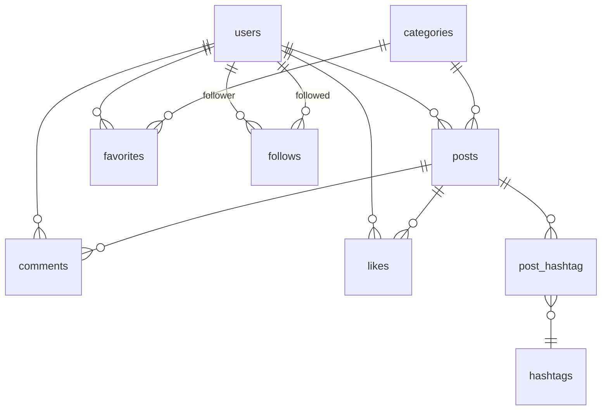

# Conome（コノミー）

「好き」を共有する SNS

https://conome-4e6d09dc0d5e.herokuapp.com/

## 1. アプリ概要

準備中...

## 2. アプリの使い方

準備中...

## 3. 要件定義

**実装優先度**

- p1：必ず実装
- p2：実装予定
- p3：余裕があれば実装

### 機能要件

**ユーザー管理**

- p1: 新規登録・ログイン・ログアウト・アカウント削除
- p3: 新規登録時のメール認証
- p1: パスワードリセット
- p3: メールアドレス変更
- p1: ログイン維持
- p3: ソーシャルログイン
- p1: プロフィール編集

**投稿**

- p1: タイトルと推しポイント
- p1: 画像
- p3: 動画
- p3: ハッシュタグ（ラベル）
- p1: カテゴリお気に入り

**投稿一覧表示**

- p1: 全ユーザーの投稿表示
- p1: プロフィールから自分の投稿表示
- p2: フォローユーザーの投稿表示
- p2: お気に入りカテゴリーをサイドバーに追加

**インタラクション**

- p2: いいね（投稿）
- p3: いいね（コメント）
- p2: お気に入り（カテゴリー）
- p2: フォロー・フォロワー
- p3: ユーザーブロック
- p3: ユーザー非表示
- p3: 拡散
- p2: コメント
- p3: コメントへのコメント（ツリー）
- p3: ダイレクトメッセージ
- p3: 外部サイトでの共有

**検索機能**

- p1: ユーザー検索
- p3: ハッシュタグ検索
- p1: キーワード検索

**通知機能**

- p3: フォロー・いいね・拡散・コメント・ダイレクトメッセージ時の通知
- p3: ブラウザプッシュ通知

### 非機能要件

**セキュリティ**

- データ暗号化
- スパム・不適切コンテンツ対策
- 個人情報を収集しない

**ユーザビリティ**

- 直感的で使いやすい UI/UX
- レスポンシブ対応
- 多言語対応

**パフォーマンス**

- 高速なレスポンス時間
- 大量のデータを処理できるスケーラビリティ

**可用性**

- 24 時間 365 日の安定稼働
- バックアップ

## 4. URI 設計

| メソッド | URI                         | 説明                                   |
| -------- | --------------------------- | -------------------------------------- |
| GET      | /                           | トップ                                 |
| GET      | /login                      | ログイン                               |
| GET      | /register                   | 新規登録                               |
| GET      | /settings                   | アカウント設定                         |
| GET      | /{uid}                      | プロフィール                           |
| GET      | /{uid}/comments             | プロフィールのコメントした投稿一覧     |
| GET      | /{uid}/likes                | プロフィールのいいねした投稿一覧       |
| GET      | /posts                      | 投稿一覧                               |
| GET      | /posts/followed             | フォローユーザーの投稿一覧             |
| GET      | /{uid}/posts/{id}           | 投稿詳細                               |
| POST     | /posts                      | 投稿作成                               |
| DELETE   | /posts/{id}                 | 投稿削除                               |
| GET      | /categories/{slug}          | カテゴリー別投稿一覧                   |
| GET      | /categories/{slug}/followed | フォローユーザーのカテゴリー別投稿一覧 |
| POST     | /posts/{id}/comments        | 投稿へのコメント                       |
| DELETE   | /comments/{id}              | 投稿へのコメントの削除                 |
| POST     | /categories/{id}/favorite   | カテゴリーのお気に入り                 |
| POST     | /posts/{id}/like            | 投稿へのいいね                         |
| POST     | /follow/{user_id}           | ユーザーフォロー                       |
| DELETE   | /unfollow/{user_id}         | ユーザーフォロー解除                   |

## 5. データベース設計

**DB: PostgreSQL**

### テーブル詳細

- **ユーザー (users)**

  | #   | 論理名             | 物理名            | データ型     | Key | Not NULL | 初期値 | 備考           |
  | --- | ------------------ | ----------------- | ------------ | --- | -------- | ------ | -------------- |
  | 1   | ユーザー ID        | id                | bigint       | PK  | O        |        | AUTO_INCREMENT |
  | 2   | アカウント ID      | uid               | text         | UK  | O        |        |                |
  | 3   | 表示名             | name              | text         |     | O        |        |                |
  | 4   | 自己紹介           | content           | text         |     |          | NULL   |                |
  | 5   | 生年月日           | birthday          | date         |     |          | NULL   |                |
  | 6   | メールアドレス     | email             | varchar(255) | UK  | O        |        |                |
  | 7   | メールアドレス認証 | email_verified_at | timestamp    |     |          | NULL   |                |
  | 8   | パスワード         | password          | varchar(255) |     | O        |        |                |
  | 9   | パスワードトークン | remember_token    | varchar(100) |     |          | NULL   |                |
  | 10  | 作成日時           | created_at        | timestamptz  |     | O        |        |                |
  | 11  | 更新日時           | updated_at        | timestamptz  |     | O        |        |                |

- **カテゴリー(categories)**

  | #   | 論理名        | 物理名     | データ型    | Key | Not Null | 初期値 | 備考           |
  | --- | ------------- | ---------- | ----------- | --- | -------- | ------ | -------------- |
  | 1   | カテゴリー ID | id         | integer     | PK  | O        |        | AUTO_INCREMENT |
  | 2   | 名前          | name       | text        |     | O        |        |                |
  | 3   | スラグ        | slug       | text        |     | O        |        |                |
  | 4   | 作成日時      | created_at | timestamptz |     | O        |        |                |
  | 5   | 更新日時      | updated_at | timestamptz |     | O        |        |                |

- **投稿(posts)**

  | #   | 論理名        | 物理名      | データ型    | Key | Not Null | 初期値 | 備考           |
  | --- | ------------- | ----------- | ----------- | --- | -------- | ------ | -------------- |
  | 1   | 投稿 ID       | id          | bigint      | PK  | O        |        | AUTO_INCREMENT |
  | 2   | ユーザー ID   | user_id     | bigint      | FK  | O        |        |                |
  | 3   | カテゴリー ID | category_id | integer     | FK  | O        |        |                |
  | 4   | タイトル      | title       | text        |     | O        |        |                |
  | 5   | 内容          | content     | text        |     | O        |        |                |
  | 6   | アーカイブ    | is_archived | boolean     |     |          |        |                |
  | 7   | 作成日時      | created_at  | timestamptz |     | O        |        |                |
  | 8   | 更新日時      | updated_at  | timestamptz |     | O        |        |                |

- **コメント (comments)**

  | #   | 論理名      | 物理名     | データ型    | Key | Not Null | 初期値 | 備考           |
  | --- | ----------- | ---------- | ----------- | --- | -------- | ------ | -------------- |
  | 1   | コメント ID | id         | bigint      | PK  | O        |        | AUTO_INCREMENT |
  | 2   | ユーザー ID | user_id    | bigint      | FK  | O        |        |                |
  | 3   | 投稿 ID     | post_id    | bigint      | FK  | O        |        |                |
  | 4   | 内容        | content    | text        |     | O        |        |                |
  | 5   | 作成日時    | created_at | timestamptz |     | O        |        |                |
  | 6   | 更新日時    | updated_at | timestamptz |     | O        |        |                |

- **いいね (likes)**

  | #   | 論理名      | 物理名     | データ型    | Key | Not Null | 初期値 | 備考           |
  | --- | ----------- | ---------- | ----------- | --- | -------- | ------ | -------------- |
  | 1   | いいね ID   | id         | bigint      | PK  | O        |        | AUTO_INCREMENT |
  | 2   | ユーザー ID | user_id    | bigint      | FK  | O        |        |                |
  | 3   | 投稿 ID     | post_id    | bigint      | FK  | O        |        |                |
  | 4   | 作成日時    | created_at | timestamptz |     | O        |        |                |
  | 5   | 更新日時    | updated_at | timestamptz |     | O        |        |                |

- **お気に入り (favorites)**

  | #   | 論理名        | 物理名      | データ型    | Key | Not Null | 初期値 | 備考           |
  | --- | ------------- | ----------- | ----------- | --- | -------- | ------ | -------------- |
  | 1   | お気に入り ID | id          | bigint      | PK  | O        |        | AUTO_INCREMENT |
  | 2   | ユーザー ID   | user_id     | bigint      | FK  | O        |        |                |
  | 3   | カテゴリー ID | category_id | integer     | FK  | O        |        |                |
  | 4   | 作成日時      | created_at  | timestamptz |     | O        |        |                |
  | 5   | 更新日時      | updated_at  | timestamptz |     | O        |        |                |

- **フォロー (follows)**

  | #   | 論理名                          | 物理名      | データ型    | Key | Not Null | 初期値 | 備考           |
  | --- | ------------------------------- | ----------- | ----------- | --- | -------- | ------ | -------------- |
  | 1   | ID                              | id          | bigint      | PK  | O        |        | AUTO_INCREMENT |
  | 2   | フォローしているユーザーの ID   | follower_id | bigint      |     | O        |        |                |
  | 3   | フォローされているユーザーの ID | followed_id | bigint      |     | O        |        |                |
  | 4   | 作成日時                        | created_at  | timestamptz |     | O        |        |                |
  | 5   | 更新日時                        | updated_at  | timestamptz |     | O        |        |                |

- **ハッシュタグ (hashtags)**

  | #   | Key | 論理名          | 物理名     | データ型    | Not Null | 初期値 | 備考           |
  | --- | --- | --------------- | ---------- | ----------- | -------- | ------ | -------------- |
  | 1   | PK  | ハッシュタグ ID | id         | bigint      | O        |        | AUTO_INCREMENT |
  |     |     | 名前            | name       | text        | O        |        |                |
  |     |     | 作成日時        | created_at | timestamptz | O        |        |                |
  |     |     | 更新日時        | updated_at | timestamptz | O        |        |                |

- **ハッシュタグ・投稿 (hashtag_post)**

  | #   | Key | 論理名          | 物理名     | データ型    | Not Null | 初期値 | 備考           |
  | --- | --- | --------------- | ---------- | ----------- | -------- | ------ | -------------- |
  | 1   | PK  | ID              | id         | bigint      | O        |        | AUTO_INCREMENT |
  |     | FK  | 投稿 ID         | post_id    | text        | O        |        |                |
  |     | FK  | ハッシュタグ ID | hashtag_id | bigint      | O        |        |                |
  |     |     | 作成日時        | created_at | timestamptz | O        |        |                |
  |     |     | 更新日時        | updated_at | timestamptz | O        |        |                |

### ER 図

## 6. システム構成図

準備中...

## 7. 使用技術

準備中...

### 言語

- PHP

### フレームワーク

- Laravel
- Tailwind CSS
- Next.js（Blade から移行予定）

### ライブラリ

- Alpine.js

### データベース

- PostgreSQL

### ミドルウェア

- Nginx

### インフラ

- Heroku
- Vercel（Next.js 移行時のフロント側）

### CI / CD

-

### 開発環境

- Docker
- Git
- GitHub
- pgAdmin4
- Visual Studio Code
